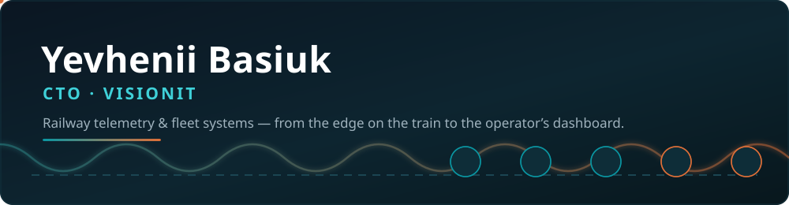

**CTO @ [VisionIT](https://visionit.ai) · railway telemetry**

I build the systems that keep trains running: telemetry, on-train edge devices, and the maintenance
software crews and operators use every day.

### Stack

---

> 🇺🇦 🇹🇷 🇵🇱 🇰🇷 🇺🇿 — building rail systems across five countries. 🚆
